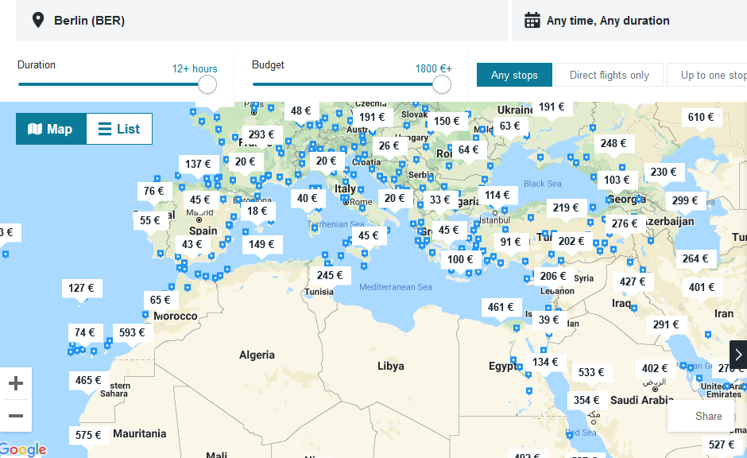
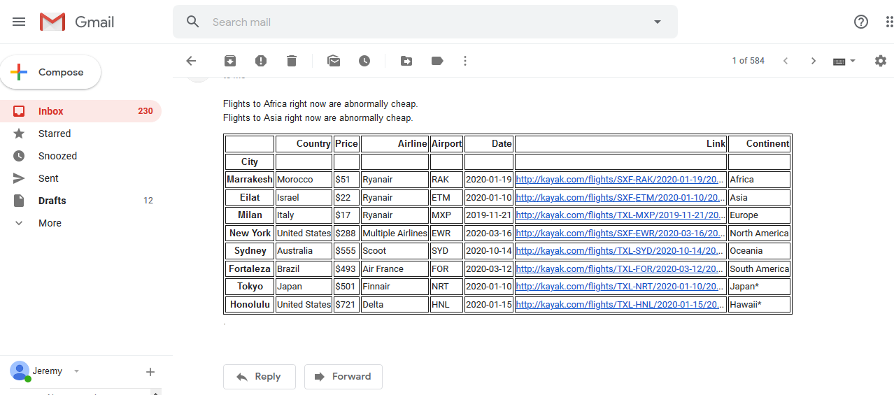

# Flight scraping from the Kayak explore feature

This program is useful if you want to take a vacation somewhere exotic, but don't know where!

It will scrape the best flight deals from the map shown in this picture, match each featured city to a continent, and send you an email dislaying the flight information for the best deals to each continent. To match cities to continents, several wikipedia pages are scraped and parsed.

The data frame which is sent as an email can also feature regional destinations of particular desiribility. In this case we have the best deals to Japan and to Hawaii included as columns.

